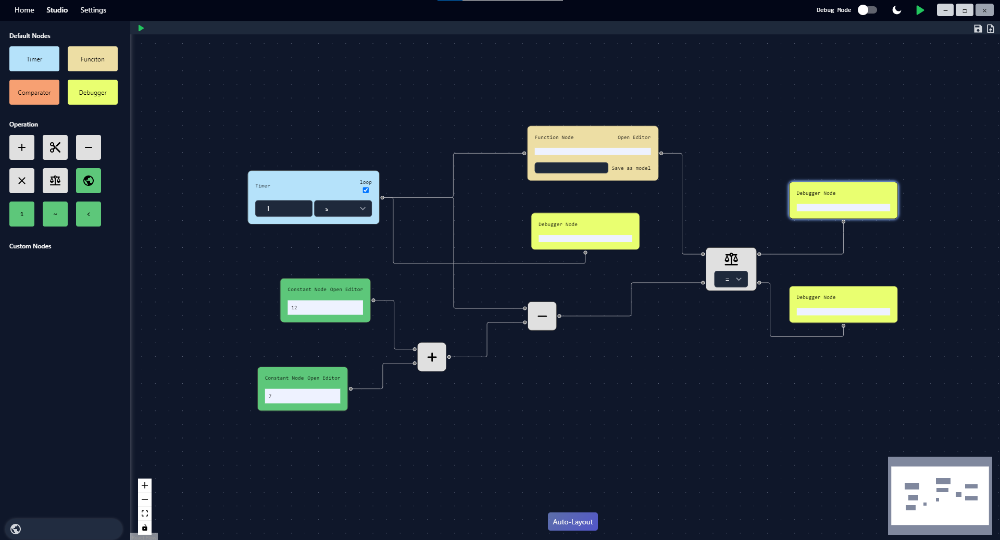

# Visual Coding Software
### *** THIS IS ONLY THE GUI ***
In this repository you'll find the graphical interface for a fully functional visual coding software build with React and Electorn (this repo) and Python (the backend repo, look below for the link).

This software is just a base sw, intended to be expanded for custom, specific usages and it's written by taking this Idea on mind.

In order to make this working, clone both this and the backend repo, create an executable of the backend repo (for example using pyinstaller) and put the exec. in the "server" folder of the frontend repo. then run the command "npm run build" followed by "npm run electron:serve" to create an installer for the sw. 
Many customization can be made before all those steps. 

## Table of Contents
- [Features](#features)
- [Prerequisites](#prerequisites)
- [Installation](#installation)
  - [Backend](#backend)
  - [Frontend](#frontend)
- [Usage](#usage)
- [License](#license)
- [Authors and Acknowledgments](#authors-and-acknowledgments)
- [Screenshots](#screenshots)

## Features
All the features of this software are inside of the nodes so, any listed feature is also a node in the software.
Nodes can be added by the user before the packaging and, if so, they must be hardcoded both on the frontend and backend.
in order to do so you have to:
- create a custom node mantaining the same format of the others contained in ./src/components/flow/customNodes/**
- add it's definition in ./src/components/flow/nodeDefinition.js as describend in the file
- Create the node in the backend as described in the backend repo docs
- Rebuild all

List of the software's nodes features:
- Algebraic operations
- Local and global variable management
- Signals and portals
- Demuxer
- Timer nodes
- Function node for Python scripts
- Many more...

## Prerequisites

- Python (version 3.8.x or greater)
- Node.js (I used version 10.1.0 but can works with other)
- all dependencies depicted in package.json and requirements.txt (the last in backend repo)

## Installation

both this and the backend repo must be packaged.
for a simpler usage process, here the istallation folder: ->

### Since I'm using pyinstaller, there's the possibility that the antivisur recognise the .exe made by pyinstaller as a trojan. If so, you need to make an installer by yourself and avoid using my installton folder.

### Backend

On the backend repo

### Frontend

After packaged the backend:
- put the executable (or the one-fodler) inside the ./server folder.
- go to ./public/main.js and adjust the BACKEND_PATH variable accordingly
- be sure to have all the dependecies installer or do it by doing `npm i`
- run `npm run build` to create the react build
- [optional] run `npm run electron:serve` to open a development verison of the code to see if working
- run `npm run electron:build` to create the final installation folder (it'll create the ./dist folder)
- inside the folder, run the <name>_setup.exe

## Usage

To use the software, go in the Studio tab, drag and drop nodes, connect them and press play.

## License

This software is released under the MIT License. This license permits free use, modification, and distribution, under the conditions that the license and copyright notice are included with all copies or substantial portions of the software. For more details, see the LICENSE file in the source distribution.

## Authors and Acknowledgments

Gianmaria Castaldini

## Screenshots

